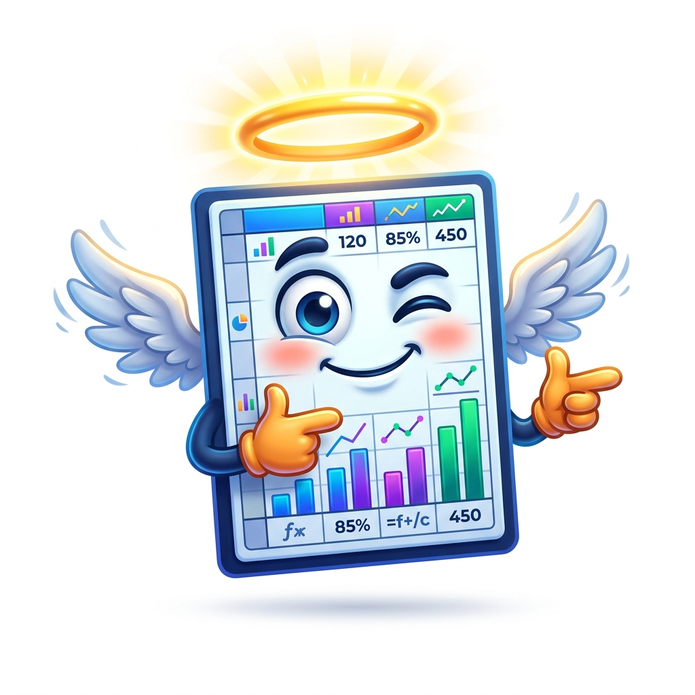
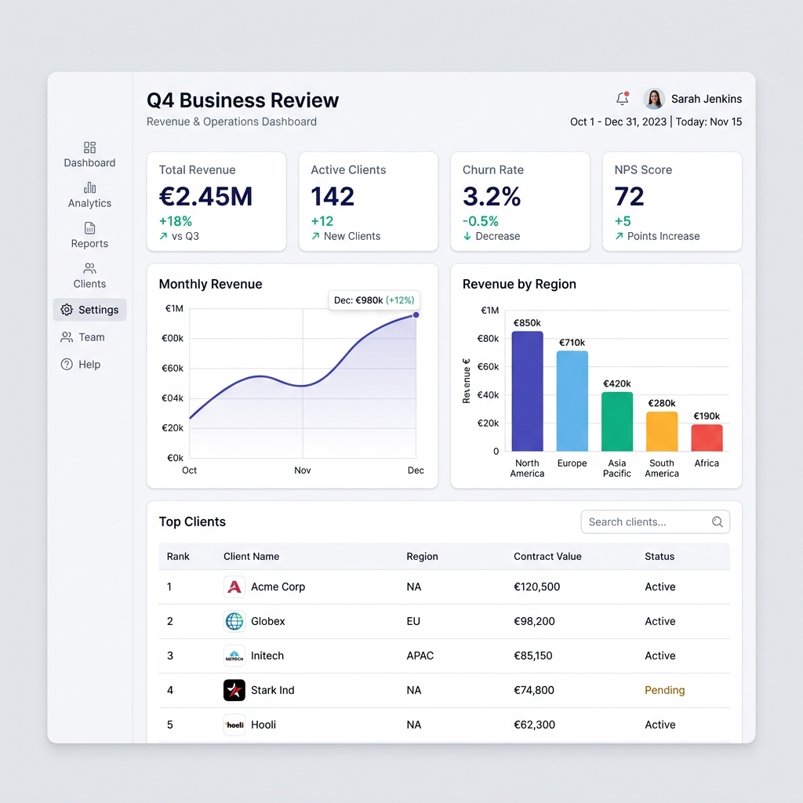
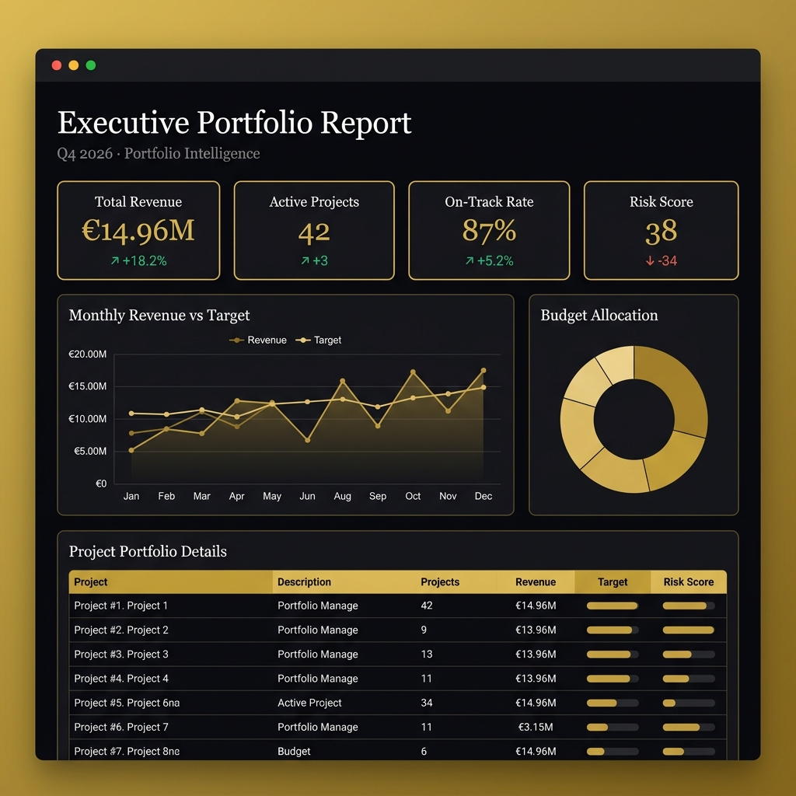
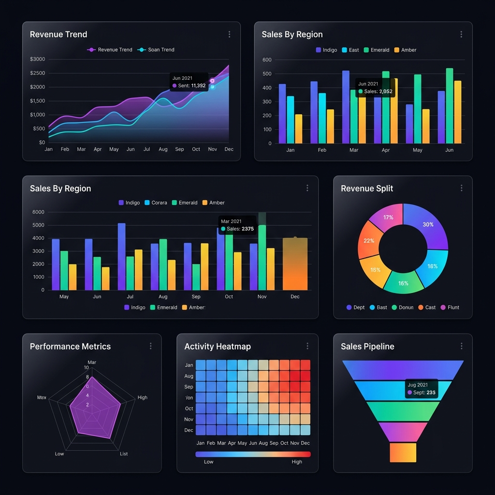
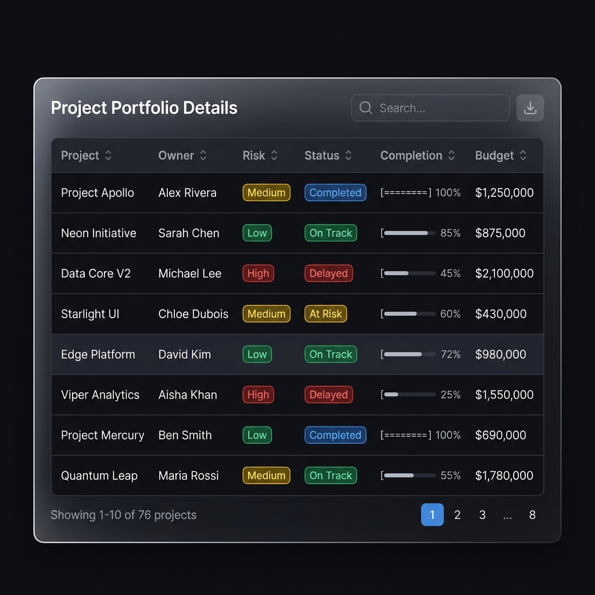
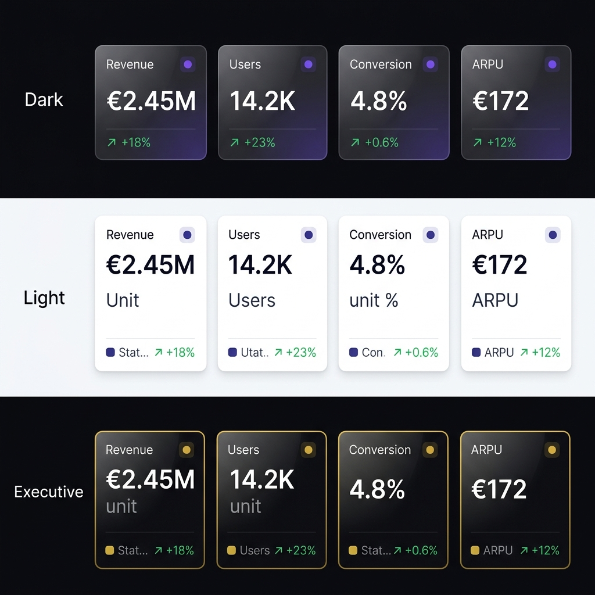

<p align="center">
  
</p>

<h1 align="center">📊 HolySheet</h1>

<p align="center">
  <strong>Python-first report compiler that turns raw data into stunning,<br>interactive React dashboards — zero frontend knowledge required.</strong>
</p>

<p align="center">
  
</p>

<p align="center">
  <a href="https://pypi.org/project/holysheet"></a>
  <a href="https://pypi.org/project/holysheet"></a>
  <a href="https://pypi.org/project/holysheet"></a>
  <a href="https://github.com/UnicoLab/holysheet/blob/main/LICENSE"></a>
  <a href="https://github.com/UnicoLab/holysheet/actions"></a>
  <a href="https://unicolab.github.io/holysheet"></a>
</p>

<p align="center">
  <a href="https://unicolab.github.io/holysheet">📖 Documentation</a> •
  <a href="#-see-it-in-action">Screenshots</a> •
  <a href="#-quickstart">Quickstart</a> •
  <a href="#-installation">Installation</a> •
  <a href="#-block-reference">Block Reference</a> •
  <a href="#-examples">Examples</a> •
  <a href="#-architecture">Architecture</a> •
  <a href="#-development">Development</a>
</p>

---

## 📸 See It In Action

> **Don't take our word for it — see what HolySheet generates:**

<table>
<tr>
<td align="center">
<strong>🌙 Dark Theme</strong><br/>

</td>
<td align="center">
<strong>☀️ Light Theme</strong><br/>

</td>
<td align="center">
<strong>👔 Executive Theme</strong><br/>

</td>
</tr>
</table>

<p align="center">
  <sub>All dashboards above are generated from Python code — zero frontend knowledge required.<br/>Each is a single, self-contained HTML file that opens in any browser.</sub>
</p>

---

## ✨ What is HolySheet?

**HolySheet** generates stunning, self-contained, interactive HTML dashboards powered by **React** + **Apache ECharts** — without requiring Node.js, npm, or any frontend tooling.

> *Write your dashboard in Python. Get a gorgeous interactive report as a single HTML file.*  
> *No server. No dependencies. Just open it in a browser. Holy Sheet, that's easy!*

### ⚡ Key Highlights

- 🧱 **57 block types** — 18 charts, 6 metrics, 14 content/data, 8 layout, 9 interactive, AI insights + SQL
- 🎨 **3 premium themes** — Dark, Light, and Executive with full design systems
- 📦 **Single-file export** — One `.html` file (~1.5 MB) with everything embedded
- 🐼 **Any data source** — Pandas, Polars, dicts, lists, Google Sheets
- 🤖 **AI-powered insights** — OpenAI, Anthropic, Google Gemini integration
- 🔐 **Enterprise features** — Password protection, expiring reports, PDF export
- 🔧 **Developer tools** — CLI, hot-reload dev server, linting, report diff
- 📱 **Responsive & PWA** — Works on mobile, supports offline mode

```python
from holysheet import Report, KPI, LineChart, DataTable

report = Report(title="Executive Portfolio Report", theme="dark")

report.add(KPI(label="Revenue", value=1_250_000, unit="€", delta="+12%", status="positive"))
report.add(LineChart(title="Revenue Trend", data=revenue_df, x="date", y="revenue"))
report.add(DataTable(title="Projects", data=projects_df))

report.export_html("report.html")  # ← That's it. Open in any browser.
```

---

## 🙏 Why HolySheet?

| 😩 The Problem | 😇 The HolySheet Way |
|---|---|
| Dashboards require complex frontend setup | **Zero** frontend knowledge needed |
| Reports need a running server | Self-contained HTML files — open anywhere |
| Visualization libraries produce basic charts | Enterprise-grade React UI with interactive ECharts |
| Sharing reports is painful | Single HTML file — email it, Slack it, embed it |
| Python-to-dashboard tools look dated | Modern Material UI design with dark/light/executive themes |
| Data wrangling across libraries | Native **Pandas**, **Polars**, dict, and list support |

---

## 🚀 Quickstart

### 1. Install

```bash
pip install holysheet
```

### 2. Build a dashboard

```python
from holysheet import Report, KPI, LineChart, BarChart, PieChart, DataTable, Section

report = Report(
    title="Q4 Business Review",
    subtitle="Revenue & Operations Dashboard",
    theme="dark",
    author="Data Team",
)

# KPI cards — they auto-arrange in a responsive grid
report.add(KPI(label="Total Revenue", value=2_450_000, unit="€", delta="+18%", status="positive"))
report.add(KPI(label="Active Clients", value=142, delta="+12", status="positive"))
report.add(KPI(label="Churn Rate", value=3.2, unit="%", delta="-0.5%", status="positive"))
report.add(KPI(label="NPS Score", value=72, delta="+5", status="positive"))

# Charts — pass any DataFrame or list of dicts
report.add(LineChart(title="Monthly Revenue", data=revenue_data, x="month", y="revenue"))
report.add(BarChart(title="Revenue by Region", data=region_data, x="region", y="revenue"))
report.add(PieChart(title="Revenue Split", data=split_data, name="category", value="amount"))

# Searchable, paginated data table
report.add(DataTable(title="Top Clients", data=clients_data, columns=["name", "revenue", "status"]))

# Export → a single portable HTML file
report.export_html("q4_review.html")
```

### 3. Open & share

```bash
open q4_review.html   # macOS
xdg-open q4_review.html  # Linux
start q4_review.html  # Windows
```

The HTML file is fully standalone — no server, no internet, no Node.js. Send it via email, upload to S3, embed in Confluence — it just works.

---

## 📦 Installation

```bash
# Core (zero extras)
pip install holysheet

# With Pandas support
pip install holysheet[pandas]

# With PDF export
pip install holysheet[pdf]

# With AI insights (OpenAI / Anthropic / Google)
pip install holysheet[ai]

# With cloud publishing (S3 / GCS)
pip install holysheet[cloud]

# With Google Sheets data source
pip install holysheet[gsheets]

# Everything
pip install holysheet[all]
```

**Requirements:**
- 🐍 Python **3.11+**
- 🚫 No Node.js required
- 🚫 No frontend build step
- 🚫 No running server

**Core dependencies:** `pydantic v2` · `jinja2` · `orjson` · `loguru` · `click`

---

## 🧱 Block Reference

HolySheet ships with **57 block types** organized into seven categories.

<details open>
<summary><strong>🖼️ Block Preview — Charts & Data Tables</strong></summary>
<br/>
<table>
<tr>
<td align="center">
<br/>
<sub>18 chart types: line, bar, pie, radar, heatmap, funnel, and more</sub>
</td>
<td align="center">
<br/>
<sub>Interactive tables with search, sort, pagination & conditional formatting</sub>
</td>
</tr>
</table>
</details>

<details open>
<summary><strong>🖼️ Block Preview — KPI Cards Across Themes</strong></summary>
<br/>
<p align="center">
  
</p>
<p align="center"><sub>KPI cards automatically adapt to your chosen theme</sub></p>
</details>

### 📊 Charts (18)

| Block | Description | Key Props |
|---|---|---|
| `LineChart` | Multi-series line chart | `data`, `x`, `y`, `series`, `annotations` |
| `AreaChart` | Filled area chart | `data`, `x`, `y`, `series`, `annotations` |
| `BarChart` | Grouped/stacked bar chart | `data`, `x`, `y`, `series`, `annotations` |
| `PieChart` | Pie / donut chart | `data`, `name`, `value` |
| `ScatterChart` | Scatter / bubble plot | `data`, `x`, `y`, `size`, `category` |
| `RadarChart` | Radar / spider chart | `data`, `indicators` |
| `GaugeChart` | Speedometer gauge | `value`, `min`, `max`, `thresholds` |
| `FunnelChart` | Conversion funnel | `data`, `name`, `value` |
| `TreemapChart` | Hierarchical treemap | `data`, `name`, `value`, `category` |
| `HeatmapChart` | 2D heatmap with color gradient | `data`, `x`, `y`, `value` |
| `CandlestickChart` | Financial OHLC chart | `data`, `x`, `open`, `close`, `low`, `high` |
| `SankeyChart` | Flow / energy diagram | `nodes`, `links` |
| `WaterfallChart` | Waterfall / bridge chart | `data`, `category`, `value` |
| `BoxPlotChart` | Statistical box plot | `data`, `categories` |
| `MapChart` | Geographical scatter | `data`, `lat`, `lng`, `value`, `name` |
| `GanttChart` | Project timeline 🆕 | `tasks` `[{name, start, end, progress}]` |
| `DAGChart` | Directed acyclic graph 🆕 | `nodes`, `edges`, `layout` |
| `CorrelationMatrix` | Correlation heatmap 🆕 | `matrix`, `labels` |

### 🧠 AI & Data Sources (3)

| Block | Description | Key Props |
|---|---|---|
| `AIInsight` | LLM-powered data narrative 🆕 | `data`, `provider`, `prompt`, `api_key` |
| `GoogleSheet` | Google Sheets data source 🆕 | `spreadsheet_id`, `sheet_name`, `range` |
| `SqlBlock` | Client-side SQL queries 🆕 | `query`, `data`, `output` |

### 📈 Metrics (6)

| Block | Description | Key Props |
|---|---|---|
| `KPI` | Key metric card with delta + tooltips | `label`, `value`, `unit`, `delta`, `status`, `tooltip_detail` |
| `Metric` | Compact inline metric | `label`, `value`, `unit`, `icon` |
| `ProgressBar` | Progress indicator | `label`, `value`, `max`, `color` |
| `StatComparison` | Side-by-side comparison | `title`, `items` |
| `Scorecard` | Conditional color metric grid 🆕 | `data`, `columns`, `thresholds` |
| `DataProfile` | Auto-EDA summary cards 🆕 | `columns` `[{name, dtype, count, ...}]` |

### 📝 Content (12)

| Block | Description | Key Props |
|---|---|---|
| `DataTable` | Searchable table + conditional formatting | `data`, `columns`, `formatting`, `downloadable` |
| `Markdown` | Rich text content | `content` |
| `CodeBlock` | Syntax-highlighted code | `code`, `language`, `title` |
| `Image` | Image display | `src`, `alt`, `caption` |
| `Alert` | Callout / notification | `severity`, `title`, `message` |
| `Timeline` | Vertical event timeline | `events` `[{date, title, description}]` |
| `Callout` | Styled quote / highlight | `content`, `author`, `variant` |
| `JsonViewer` | Interactive JSON tree | `data`, `collapsed_depth` |
| `UserCard` | Team member card | `name`, `role`, `avatar_url`, `stats` |
| `StatusList` | Status indicators list | `items` `[{label, status, value}]` |
| `InfoList` | Key-value pair display | `items` `[{key, value, icon}]` |
| `Sparkline` | Tiny inline chart | `data`, `color`, `show_area` |
| `NarrationBlock` | Voice narration (Web Speech API) 🆕 | `text`, `autoplay` |

### 📐 Layout (8)

| Block | Description | Key Props |
|---|---|---|
| `Section` | Group blocks with a heading | `title`, `description`, `children` |
| `Columns` | Multi-column responsive grid | `children`, `widths` |
| `Tabs` | Tabbed content panels | `tabs` (list of `{label, children}`) |
| `Divider` | Visual separator line | `label`, `variant` |
| `Accordion` | Collapsible content panels | `panels` (list of `{title, children}`) |
| `Stepper` | Process / wizard steps | `steps` `[{label, description, status}]` |
| `TagList` | Colored tag/badge chips | `tags` `[{label, color}]` |
| `Compare` | Side-by-side comparison layout 🆕 | `left_label`, `right_label`, `left_children`, `right_children` |

### 🎮 Interactive (9)

| Block | Description | Key Props |
|---|---|---|
| `Slider` | Range slider input | `label`, `min`, `max`, `default_value` |
| `NumberInput` | Numeric input field | `label`, `default_value`, `step` |
| `Toggle` | On/off switch | `label`, `default_value` |
| `Dropdown` | Select from options | `label`, `options`, `default_value` |
| `TextInput` | Text / textarea input | `label`, `placeholder`, `multiline` |
| `CheckboxGroup` | Multiple checkboxes | `label`, `options`, `default_values` |
| `RadioGroup` | Single-select radio buttons | `label`, `options`, `default_value` |
| `Embed` | Iframe embed | `url`, `height`, `aspect_ratio` |
| `Video` | HTML5 video player | `src`, `poster`, `controls` |

---

## 🎨 Themes

Three built-in themes ship out of the box:

```python
report = Report(title="Report", theme="dark")       # 🌙 Deep dark, vibrant accents
report = Report(title="Report", theme="light")      # ☀️ Clean, professional, airy
report = Report(title="Report", theme="executive")  # 👔 Premium serif with rich greens
```

Each theme defines a complete design system: colors, typography (Inter / Georgia), spacing, shadows, and an 8-color chart palette.

<table>
<tr>
<td align="center">
<strong>🌙 Dark</strong><br/>
<br/>
<sub>Glassmorphism cards, vibrant accents<br/>Ideal for internal dashboards</sub>
</td>
<td align="center">
<strong>☀️ Light</strong><br/>
<br/>
<sub>Clean, professional, print-ready<br/>Ideal for client-facing reports</sub>
</td>
<td align="center">
<strong>👔 Executive</strong><br/>
<br/>
<sub>Gold accents, serif typography<br/>Ideal for board presentations</sub>
</td>
</tr>
</table>

---

## 📚 Examples

### Minimal Status Page

```python
from holysheet import Report, KPI, Markdown, Alert

report = Report(title="System Status", theme="dark")

report.add(Alert(severity="success", title="All Systems Operational", message="Last checked: 2 minutes ago"))
report.add(KPI(label="Uptime", value=99.97, unit="%", status="positive"))
report.add(KPI(label="Response Time", value=142, unit="ms", status="neutral"))
report.add(KPI(label="Error Rate", value=0.03, unit="%", delta="-0.01%", status="positive"))
report.add(Markdown(content="Monitored endpoints: **API**, **Auth**, **CDN**, **Database**"))

report.export_html("status.html")
```

### Executive Dashboard with Sections & Columns

```python
from holysheet import Report, KPI, LineChart, BarChart, DataTable, Section, Columns, Markdown

report = Report(
    title="AIFlow Executive Report",
    subtitle="Portfolio risk and delivery intelligence",
    theme="executive",
    author="Strategy Team",
)

# Executive summary
report.add(Markdown(content="""
## Executive Summary

Portfolio health remains strong with 42 active projects delivering on schedule.
Risk-adjusted returns are trending positively, with a 12% improvement in delivery confidence.
"""))

# Note: Variables like risk_df, team_df, projects_df should be your DataFrames

# KPI grid inside a section
report.add(Section(
    title="Key Metrics",
    children=[
        KPI(label="Active Projects", value=42, delta="+3", status="positive"),
        KPI(label="On-Track", value=87, unit="%", status="positive"),
        KPI(label="At-Risk", value=5, status="negative"),
        KPI(label="Budget Utilization", value=76, unit="%", status="neutral"),
    ],
))

# Side-by-side charts
report.add(Columns(children=[
    LineChart(title="Risk Score Trend", data=risk_df, x="date", y="score"),
    BarChart(title="Delivery by Team", data=team_df, x="team", y="delivered"),
]))

# Detailed data
report.add(DataTable(
    title="Project Details",
    data=projects_df,
    columns=["project", "owner", "risk", "status", "completion"],
))

report.export_html("executive_report.html")
```

### Multi-Chart Analytics with Tabs

```python
from holysheet import Report, Tabs, LineChart, BarChart, PieChart, FunnelChart

report = Report(title="Sales Analytics", theme="dark")

report.add(Tabs(tabs=[
    {
        "label": "📈 Trends",
        "children": [
            LineChart(title="Monthly Sales", data=sales_df, x="month", y="total"),
            LineChart(title="Customer Growth", data=growth_df, x="month", y="customers"),
        ],
    },
    {
        "label": "📊 Breakdown",
        "children": [
            BarChart(title="Sales by Region", data=region_df, x="region", y="sales"),
            PieChart(title="Product Mix", data=product_df, name="product", value="revenue"),
        ],
    },
    {
        "label": "🔄 Pipeline",
        "children": [
            FunnelChart(title="Sales Funnel", data=funnel_df, name="stage", value="count"),
        ],
    },
]))

report.export_html("sales_analytics.html")
```

<details>
<summary><strong>🖼️ Example Output — Sales Dashboard (Executive Theme)</strong></summary>
<br/>
<p align="center">
  
</p>
<p align="center"><sub>Generated by <code>examples/sales_dashboard.py</code> — a single self-contained HTML file</sub></p>
</details>

> 💡 **More examples** in the [`examples/`](examples/) directory — including a full showcase with every block type.

---

## 📤 Export Modes

### Standalone HTML *(default)*

```python
report.export_html("report.html")
```

Generates a **single, self-contained HTML file** (~1.5 MB) with embedded React, CSS, and data. Zero external dependencies. Open directly in any browser.

### Folder Export

```python
report.export_folder("dist/")
```

Generates a deployable folder structure:

```
dist/
  index.html       ← Entry point
  assets/
    app.js         ← React bundle
    app.css        ← Styles
  report.json      ← Dashboard spec
```

Ideal for hosting on a web server, S3, or CDN.

### PDF Export

```python
report.export_pdf("report.pdf", landscape=True, margin="0.5in")
```

Requires Playwright (`pip install holysheet[pdf]`) or Chrome/Chromium.

### JSON Export

```python
report.export_json("report.json")
```

Exports just the dashboard specification as JSON. Useful for debugging, version control, or feeding into external rendering pipelines.

---

## 🗄️ Data Formats

HolySheet auto-detects and converts data from multiple formats:

```python
# ✅ List of dicts
data = [{"name": "Alice", "score": 95}, {"name": "Bob", "score": 87}]

# ✅ Dict of lists
data = {"name": ["Alice", "Bob"], "score": [95, 87]}

# ✅ Pandas DataFrame
import pandas as pd
data = pd.DataFrame({"name": ["Alice", "Bob"], "score": [95, 87]})

# ✅ Polars DataFrame
import polars as pl
data = pl.DataFrame({"name": ["Alice", "Bob"], "score": [95, 87]})
```

All formats are normalized to records internally via `holysheet.data.to_records()`.

---

## 💻 CLI

```bash
# Validate a report spec
holysheet validate report.json

# Serve a report locally (opens browser)
holysheet serve report.json

# Hot-reload dev server — auto-refreshes on Python script changes
holysheet dev my_report.py --port 8000

# Lint a report for best practices
holysheet lint my_report.py --strict

# Compare two report versions
holysheet diff old_report.json new_report.json

# Show version
holysheet version

# Publish to S3 or Google Cloud Storage
holysheet publish report.html -t s3://my-bucket/reports/q4.html --public
holysheet publish report.html -t gs://my-bucket/reports/q4.html
```

---

## 🔥 Advanced Features

### Custom Themes

```python
from holysheet import Report, Theme

brand = Theme(name="acme", primary="#FF6B00", background="#0A0A0F", font="Satoshi")
report = Report(title="Acme Report", theme=brand)
```

### Multi-Page Reports

```python
report.add_page("Overview", [KPI(label="Revenue", value="$1.2M")])
report.add_page("Details", [DataTable(title="Breakdown", data=df)])
```

### Chart Annotations

```python
report.add(LineChart(
    title="Revenue", data=df, x="month", y="revenue",
    annotations=[{"x": "Mar", "text": "Product Launch", "color": "#22d3ee"}]
))
```

### Global Filters

```python
report.add_filter("region", type="dropdown", options=["NA", "EU", "APAC"])
```

### Jupyter Integration

```python
report.show()  # Renders inline in Jupyter notebook
```

### Password Protection & Expiry

```python
report.export_html("secure.html", password="s3cret")  # AES-256 encrypted
Report(title="Temp", expires="2025-12-31")  # Auto-expires
```

### Report Templates

```python
from holysheet.templates import SalesDashboard, ExecutiveSummary, OpsMonitor

blocks = SalesDashboard(data={"kpis": {"revenue": "$1.2M", "deals_won": 42}})
```

### Anomaly Detection

```python
report.add(LineChart(
    title="Server Latency", data=metrics, x="time", y="latency_ms",
    anomaly_detection=True,  # Auto-detect and annotate outliers
))
```

### AI-Powered Insights

```python
from holysheet import AIInsight
report.add(AIInsight(title="Key Findings", data=df, provider="openai"))
```

### SQL Block

```python
from holysheet import SqlBlock
report.add(SqlBlock(
    query="SELECT region, SUM(revenue) FROM data GROUP BY region",
    data=sales_df,
))
```

### Voice Narration

```python
from holysheet import NarrationBlock
report.add(NarrationBlock(text=report.auto_narrate()))
```

---

## 🏗️ Architecture

```
Python API  →  Pydantic v2 Schema  →  JSON Spec  →  React Renderer  →  HTML Dashboard
```

HolySheet operates in two distinct phases:

### 🔧 Build Time *(Python — your machine)*

1. You define blocks using the Python API
2. HolySheet validates everything with **Pydantic v2** models
3. Generates a versioned JSON dashboard specification
4. Injects the spec into a **prebuilt React application**
5. Exports a self-contained HTML file via **Jinja2** templates

### 🌐 Runtime *(Browser — any machine)*

1. Browser opens the HTML file (no server needed)
2. React reads the embedded dashboard spec from `<script id="report-data">`
3. Renders each block through a **component registry** (`type` → React component)
4. Charts become interactive via **Apache ECharts**
5. Tables support real-time search and pagination

> **The key insight:** The React app is **prebuilt and bundled inside the Python package**. End users never need Node.js, npm, or any frontend tooling.

### Project Structure

```
HolySheet/
  src/holysheet/           # Python package
    __init__.py            #   Public API (20 block types + Report)
    blocks.py              #   Pydantic v2 block models
    schema.py              #   Report schema model
    report.py              #   Main Report class + export methods
    data.py                #   Data normalization (pandas/polars/dict/list)
    exporters.py           #   HTML / folder / JSON exporters
    themes.py              #   Theme system (light / dark / executive)
    exceptions.py          #   Custom exception hierarchy
    cli.py                 #   Click-based CLI (validate, serve, version)
    renderer/              #   Prebuilt React assets (JS + CSS)
    templates/             #   Jinja2 HTML templates

  frontend/                # React source (development only)
    src/
      components/          #   React block components
      theme.ts             #   MUI theme definitions
      registry.tsx         #   Block type → component mapping
      types.ts             #   TypeScript interfaces

  tests/                   # Python test suite
  examples/                # Example scripts
```

---

## 🛠️ Development

### Prerequisites

- Python **3.11+**
- Node.js **18+** *(frontend development only)*
- Make

### Setup

```bash
git clone https://github.com/UnicoLab/HolySheet.git
cd HolySheet

# Full development setup (frontend + Python)
make dev

# Or step by step:
make frontend-install   # Install frontend npm dependencies
make frontend-build     # Build React app → src/holysheet/renderer/
make install            # Install Python package in editable mode
```

### Common Commands

```bash
make test              # Run Python test suite
make lint              # Lint with ruff
make typecheck         # Type-check with mypy (strict mode)
make format            # Auto-format with ruff
make build             # Build distributable wheel + sdist
make clean             # Clean all build artifacts
```

### Releases

HolySheet uses [python-semantic-release](https://github.com/python-semantic-release/python-semantic-release) with conventional commits:

| Prefix | Effect |
|---|---|
| `feat:` | Minor version bump |
| `fix:` / `perf:` | Patch version bump |
| `BREAKING CHANGE:` | Major version bump |

---

## 🗺️ Roadmap

- [x] 📊 Advanced chart types (Sankey, Gantt, DAG, Correlation Matrix)
- [x] 🔍 Interactive filters and global filter bar
- [x] 📑 Multi-page tabbed report navigation
- [x] 🎨 Custom theme API + enterprise branding
- [x] 🔐 Password-protected & expiring reports
- [x] 📥 CSV download buttons on tables & charts
- [x] 📓 Jupyter notebook integration
- [x] 🎯 Chart annotations (vertical lines, point markers)
- [x] 📽️ Presentation mode (sections as slides)
- [x] 🌗 Dark/Light theme toggle in viewer
- [x] 🏗️ Report templates (SalesDashboard, ExecutiveSummary, OpsMonitor)
- [x] 🔧 Hot-reload dev server + report linting + report diff CLI
- [x] 🤖 AI narrative blocks (AIInsight with OpenAI / Anthropic / Google)
- [x] 📄 PDF export (Playwright / Chrome)
- [x] 🗄️ SQL Block (client-side query engine)
- [x] 🔊 Voice narration (Web Speech API)
- [x] 📈 Anomaly detection on charts (IQR + MAD)
- [x] ☁️ Cloud publish CLI (S3 / GCS)
- [x] 📊 Google Sheets data source
- [x] 🔄 Cross-block reactive filtering
- [x] 📜 Virtual scrolling for large tables
- [x] 🗺️ Report navigator (minimap)
- [x] 📱 PWA mode + responsive layouts
- [ ] 📊 PowerPoint export
- [ ] 🧩 Custom React component injection
- [ ] 💬 Local chatbot over report data

---

## 🤝 Contributing

Contributions are welcome! Here's how to get started:

1. **Fork** the repository
2. **Create** a feature branch: `git checkout -b feat/amazing-feature`
3. **Write** your changes with tests
4. **Check** everything passes: `make lint && make typecheck && make test`
5. **Commit** with [conventional commits](https://www.conventionalcommits.org/): `feat:`, `fix:`, `docs:`, etc.
6. **Open** a Pull Request

See the [Contributing Guide](CONTRIBUTING.md) for detailed instructions.

---

## 📄 License

MIT License — see [LICENSE](LICENSE) for details.

---

<p align="center">
  Built with ❤️ by <a href="https://github.com/UnicoLab">UnicoLab</a>
</p>

<p align="center">
  <sub>Holy Sheet, that's a beautiful dashboard! 🙌</sub>
</p>

<p align="center">
  <sub>
    <a href="https://pypi.org/project/holysheet">PyPI</a> ·
    <a href="https://unicolab.github.io/holysheet">Documentation</a> ·
    <a href="https://github.com/UnicoLab/holysheet/issues">Issues</a> ·
    <a href="https://github.com/UnicoLab/holysheet/discussions">Discussions</a>
  </sub>
</p>
