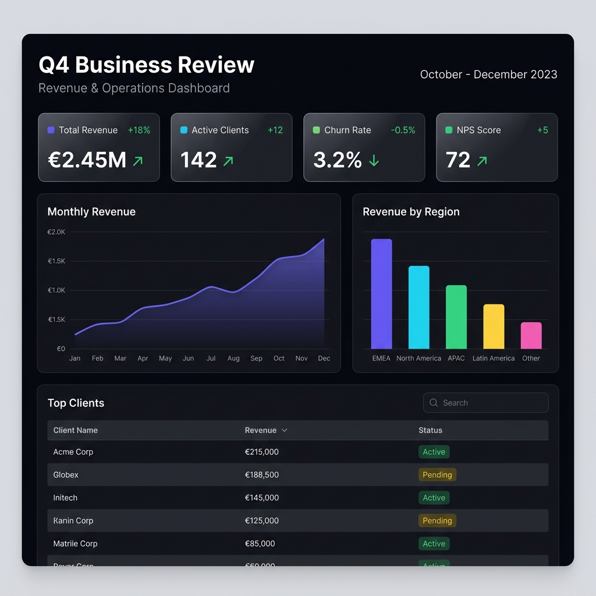

---
hide:
  - navigation
  - toc
---

# 📊 HolySheet

<div style="text-align: center; margin: 2rem 0;">
<p style="font-size: 1.4rem; font-weight: 300; color: var(--md-default-fg-color--light);">
<strong>Python-first report compiler</strong> that generates beautiful,<br>
interactive dashboards — in a single line of code.
</p>
</div>

<div style="text-align: center; margin: 2rem 0;">

<p style="font-size: 0.85rem; color: var(--md-default-fg-color--lighter); margin-top: 0.5rem;">
<em>A complete dashboard generated from Python — one HTML file, zero frontend knowledge required.</em>
</p>
</div>

<div style="text-align: center; margin: 1.5rem 0;">

[](https://pypi.org/project/holysheet)
[](https://pypi.org/project/holysheet)
[](https://github.com/UnicoLab/HolySheet/blob/main/LICENSE)

</div>

---

## :zap: Get Started in 30 Seconds

```bash
pip install holysheet
```

```python title="my_dashboard.py"
from holysheet import Report, KPI, LineChart, DataTable

report = Report(title="Q4 Business Review", theme="dark")

report.add(KPI(label="Revenue", value="$2.26M", delta="+34%", status="positive"))
report.add(KPI(label="Users", value="42,000", delta="+72%", status="positive"))
report.add(LineChart(title="Revenue Trend", data=monthly_data, x="month", y="revenue"))
report.add(DataTable(title="Top Clients", data=clients))

report.export_html("report.html")  # ← Open in any browser. Done.
```

!!! success "That's it!"
    The generated HTML is **fully self-contained** — no server, no internet, no Node.js required. Just open it in a browser, email it, or upload it anywhere.

---

## :star2: Why HolySheet?

<div class="grid cards" markdown>

-   :material-language-python:{ .lg .middle } **Python-First**

    ---

    Write dashboards in pure Python. No HTML, CSS, or JavaScript knowledge needed. Full type hints and Pydantic validation.

-   :material-file-document:{ .lg .middle } **Single-File Export**

    ---

    Generate a standalone `.html` file (~1.5 MB) with everything embedded. Share via email, Slack, S3, or Confluence.

-   :material-chart-box:{ .lg .middle } **57 Block Types**

    ---

    KPIs, 18 chart types, 9 interactive controls, data tables, AI insights, timelines, user cards, and more.

-   :material-palette:{ .lg .middle } **3 Premium Themes**

    ---

    Dark, Light, and Executive themes with complete design systems — colors, typography, spacing, and chart palettes.

-   :material-database:{ .lg .middle } **Any Data Source**

    ---

    Native support for **Pandas DataFrames**, **Polars DataFrames**, Python dicts, and lists. Auto-detection, zero config.

-   :material-react:{ .lg .middle } **Powered by React**

    ---

    Interactive dashboards rendered with React + ECharts under the hood. Searchable tables, responsive layouts, smooth animations.

</div>

---

## :rocket: Feature Highlights

| Feature | Description |
|:--------|:------------|
| :material-cube-outline: **57 block types** | KPI, Metric, 18 chart types, AI insights, data tables, Google Sheets, SQL blocks, layout containers, interactive controls |
| :material-palette-swatch: **3 themes** | `dark`, `light`, `executive` — each with a full design system |
| :material-export: **3 export modes** | Standalone HTML, folder (for hosting), or raw JSON |
| :material-console: **CLI included** | `holysheet validate`, `holysheet serve`, `holysheet version` |
| :material-view-column: **Layout system** | Columns, Sections, Tabs, Accordion, Stepper, Dividers |
| :material-gesture-tap: **Interactive controls** | Sliders, toggles, dropdowns, text inputs, checkboxes, radio buttons |
| :material-database-check: **Smart data handling** | Auto-converts pandas, polars, dicts — handles NaN, datetime, Decimal |
| :material-shield-check: **Validated** | Every block is a Pydantic v2 model with full type safety |

---

## :books: Explore the Docs

<div class="grid cards" markdown>

-   :material-play-circle:{ .lg .middle } **[Getting Started](getting-started.md)**

    ---

    Install, build your first report, and understand the architecture.

-   :material-view-dashboard:{ .lg .middle } **[Block Types](blocks/index.md)**

    ---

    Reference for all 57 block types with examples.

-   :material-palette:{ .lg .middle } **[Themes](themes.md)**

    ---

    Dark, Light, and Executive theme details.

-   :material-database:{ .lg .middle } **[Data Sources](data-sources.md)**

    ---

    Working with pandas, polars, dicts, and lists.

-   :material-export:{ .lg .middle } **[Export & Deploy](export.md)**

    ---

    HTML, folder, JSON export modes and CLI.

-   :material-code-tags:{ .lg .middle } **[API Reference](api-reference.md)**

    ---

    Complete API docs for Report, blocks, and utilities.

-   :material-image-multiple:{ .lg .middle } **[Examples Gallery](examples.md)**

    ---

    Real-world dashboard examples you can copy-paste.

-   :material-script-text:{ .lg .middle } **[Changelog](changelog.md)**

    ---

    Version history and release notes.

</div>

---

<div style="text-align: center; margin: 3rem 0 1rem;">
<p style="font-size: 0.9rem; color: var(--md-default-fg-color--lighter);">
Built with :heart: by <a href="https://github.com/UnicoLab">UnicoLab</a> · MIT License · <em>Holy Sheet, that's a beautiful dashboard!</em> :raised_hands:
</p>
</div>
